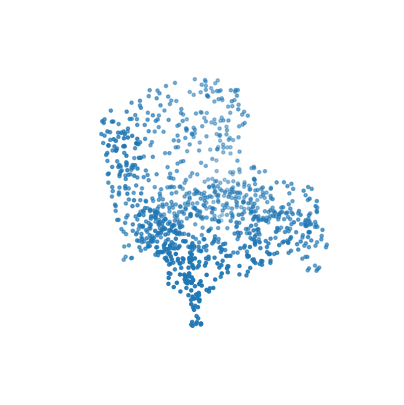
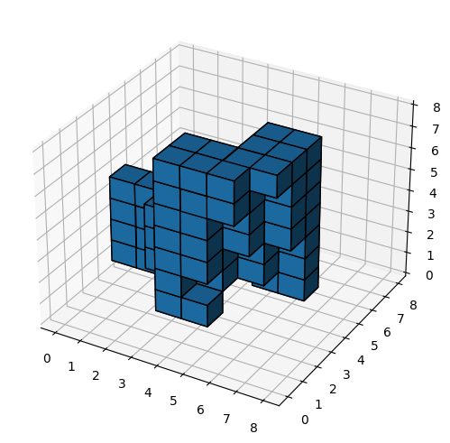
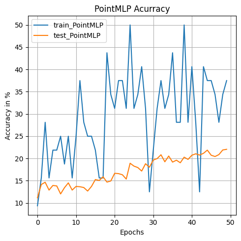
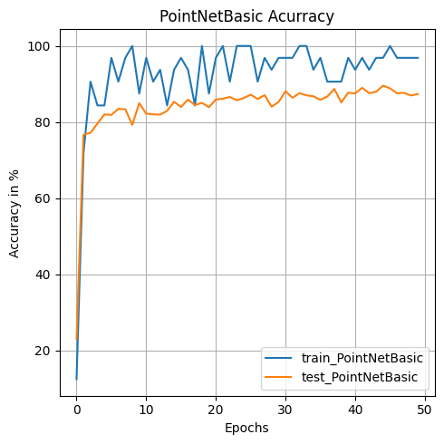
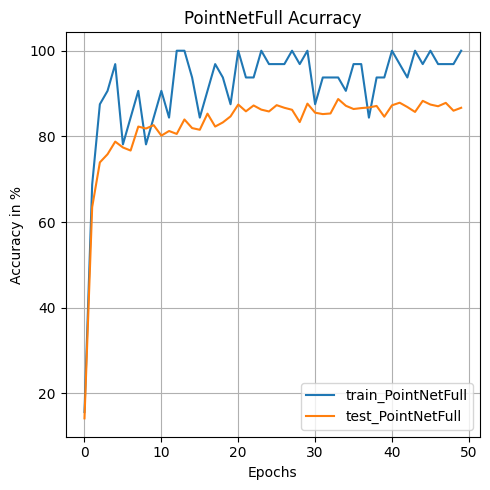
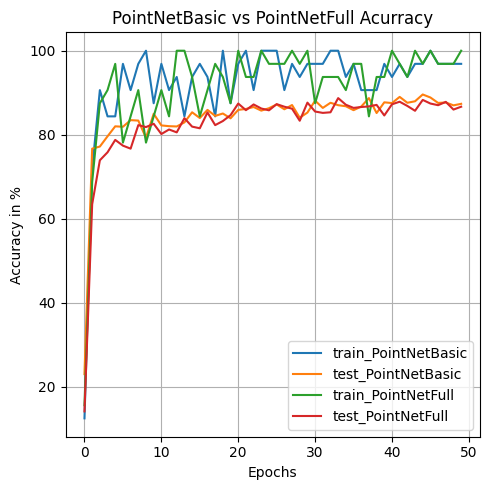

# 3D Cloud Classification : PointNet apply to ModelNet10


full code : 
https://github.com/clement-chupin/PointNet_classify_ModelNet/blob/main/main_CHUPIN_VILLENEUVE.ipynb
  


    

    


    

    


    


    Numbers of each object
    0 106 50
    1 515 100
    2 889 100
    3 200 86
    4 200 86
    5 465 100
    6 200 86
    7 680 100
    8 392 100
    9 344 100


# Results :


```python
#PointMLP, no augment
model = PointMLP(NUM_POINTS,NUM_CLASSES)
(loss_train_array_POINTMLP,
 accuracy_train_array_POINTMLP,
 loss_test_array_POINTMLP,
 accuracy_test_array_POINTMLP) = train(
    model, 
    dataloader_train,
    dataloader_test, 
    epochs=50,
    loss_func=torch.nn.CrossEntropyLoss()
)

plt.figure(1)
plt.title("PointMLP Acurracy")
plt.xlabel("Epochs")
plt.ylabel("Accuracy in %")

plt.plot(accuracy_train_array_POINTMLP,label="train_PointMLP")
plt.plot(accuracy_test_array_POINTMLP,label="test_PointMLP")
plt.grid()
plt.legend()


```

    Epoch: 1, Loss_train: 2.378, Accuracy_train: 9.4 %, Loss_test 2.485, Accuracy_test: 11.2 %
    Epoch: 2, Loss_train: 2.371, Accuracy_train: 15.6 %, Loss_test 2.376, Accuracy_test: 14.2 %
    Epoch: 3, Loss_train: 2.240, Accuracy_train: 28.1 %, Loss_test 2.342, Accuracy_test: 14.7 %
    Epoch: 4, Loss_train: 2.276, Accuracy_train: 15.6 %, Loss_test 2.335, Accuracy_test: 12.9 %
    Epoch: 5, Loss_train: 2.168, Accuracy_train: 21.9 %, Loss_test 2.316, Accuracy_test: 13.9 %
    Epoch: 6, Loss_train: 2.208, Accuracy_train: 21.9 %, Loss_test 2.304, Accuracy_test: 13.8 %
    Epoch: 7, Loss_train: 2.188, Accuracy_train: 25.0 %, Loss_test 2.325, Accuracy_test: 12.0 %
    Epoch: 8, Loss_train: 2.241, Accuracy_train: 18.8 %, Loss_test 2.320, Accuracy_test: 13.4 %
    Epoch: 9, Loss_train: 2.177, Accuracy_train: 25.0 %, Loss_test 2.312, Accuracy_test: 14.5 %
    Epoch: 10, Loss_train: 2.167, Accuracy_train: 15.6 %, Loss_test 2.316, Accuracy_test: 12.9 %
    Epoch: 11, Loss_train: 1.984, Accuracy_train: 25.0 %, Loss_test 2.335, Accuracy_test: 13.7 %
    Epoch: 12, Loss_train: 2.064, Accuracy_train: 37.5 %, Loss_test 2.338, Accuracy_test: 13.6 %
    Epoch: 13, Loss_train: 2.093, Accuracy_train: 28.1 %, Loss_test 2.329, Accuracy_test: 13.5 %
    Epoch: 14, Loss_train: 2.044, Accuracy_train: 25.0 %, Loss_test 2.326, Accuracy_test: 12.7 %
    Epoch: 15, Loss_train: 2.046, Accuracy_train: 25.0 %, Loss_test 2.327, Accuracy_test: 13.7 %
    Epoch: 16, Loss_train: 2.148, Accuracy_train: 21.9 %, Loss_test 2.304, Accuracy_test: 15.3 %
    Epoch: 17, Loss_train: 2.138, Accuracy_train: 15.6 %, Loss_test 2.322, Accuracy_test: 15.1 %
    Epoch: 18, Loss_train: 2.223, Accuracy_train: 15.6 %, Loss_test 2.306, Accuracy_test: 15.9 %
    Epoch: 19, Loss_train: 1.959, Accuracy_train: 43.8 %, Loss_test 2.309, Accuracy_test: 14.7 %
    Epoch: 20, Loss_train: 2.011, Accuracy_train: 34.4 %, Loss_test 2.311, Accuracy_test: 14.9 %
    Epoch: 21, Loss_train: 2.015, Accuracy_train: 31.2 %, Loss_test 2.297, Accuracy_test: 16.7 %
    Epoch: 22, Loss_train: 1.880, Accuracy_train: 37.5 %, Loss_test 2.280, Accuracy_test: 16.6 %
    Epoch: 23, Loss_train: 1.995, Accuracy_train: 37.5 %, Loss_test 2.266, Accuracy_test: 16.3 %
    Epoch: 24, Loss_train: 1.920, Accuracy_train: 31.2 %, Loss_test 2.303, Accuracy_test: 15.4 %
    Epoch: 25, Loss_train: 1.620, Accuracy_train: 50.0 %, Loss_test 2.240, Accuracy_test: 18.9 %
    Epoch: 26, Loss_train: 2.038, Accuracy_train: 31.2 %, Loss_test 2.267, Accuracy_test: 18.3 %
    Epoch: 27, Loss_train: 2.057, Accuracy_train: 34.4 %, Loss_test 2.260, Accuracy_test: 18.0 %
    Epoch: 28, Loss_train: 1.951, Accuracy_train: 40.6 %, Loss_test 2.262, Accuracy_test: 17.2 %
    Epoch: 29, Loss_train: 2.038, Accuracy_train: 31.2 %, Loss_test 2.245, Accuracy_test: 18.8 %
    Epoch: 30, Loss_train: 2.129, Accuracy_train: 12.5 %, Loss_test 2.250, Accuracy_test: 18.0 %
    Epoch: 31, Loss_train: 2.108, Accuracy_train: 21.9 %, Loss_test 2.229, Accuracy_test: 19.6 %
    Epoch: 32, Loss_train: 1.909, Accuracy_train: 31.2 %, Loss_test 2.213, Accuracy_test: 20.0 %
    Epoch: 33, Loss_train: 1.931, Accuracy_train: 37.5 %, Loss_test 2.216, Accuracy_test: 20.8 %
    Epoch: 34, Loss_train: 1.992, Accuracy_train: 31.2 %, Loss_test 2.205, Accuracy_test: 19.3 %
    Epoch: 35, Loss_train: 1.924, Accuracy_train: 34.4 %, Loss_test 2.196, Accuracy_test: 20.5 %
    Epoch: 36, Loss_train: 1.753, Accuracy_train: 43.8 %, Loss_test 2.217, Accuracy_test: 19.2 %
    Epoch: 37, Loss_train: 1.926, Accuracy_train: 28.1 %, Loss_test 2.205, Accuracy_test: 19.6 %
    Epoch: 38, Loss_train: 2.000, Accuracy_train: 28.1 %, Loss_test 2.174, Accuracy_test: 19.0 %
    Epoch: 39, Loss_train: 1.571, Accuracy_train: 50.0 %, Loss_test 2.177, Accuracy_test: 20.3 %
    Epoch: 40, Loss_train: 1.758, Accuracy_train: 28.1 %, Loss_test 2.181, Accuracy_test: 19.8 %
    Epoch: 41, Loss_train: 1.577, Accuracy_train: 40.6 %, Loss_test 2.155, Accuracy_test: 20.7 %
    Epoch: 42, Loss_train: 1.862, Accuracy_train: 28.1 %, Loss_test 2.151, Accuracy_test: 21.0 %
    Epoch: 43, Loss_train: 2.096, Accuracy_train: 12.5 %, Loss_test 2.130, Accuracy_test: 20.8 %
    Epoch: 44, Loss_train: 1.865, Accuracy_train: 40.6 %, Loss_test 2.139, Accuracy_test: 21.2 %
    Epoch: 45, Loss_train: 1.953, Accuracy_train: 37.5 %, Loss_test 2.132, Accuracy_test: 21.9 %
    Epoch: 46, Loss_train: 1.733, Accuracy_train: 37.5 %, Loss_test 2.115, Accuracy_test: 20.7 %
    Epoch: 47, Loss_train: 1.754, Accuracy_train: 34.4 %, Loss_test 2.145, Accuracy_test: 20.4 %
    Epoch: 48, Loss_train: 1.805, Accuracy_train: 28.1 %, Loss_test 2.120, Accuracy_test: 20.9 %
    Epoch: 49, Loss_train: 1.833, Accuracy_train: 34.4 %, Loss_test 2.128, Accuracy_test: 21.9 %
    Epoch: 50, Loss_train: 1.900, Accuracy_train: 37.5 %, Loss_test 2.116, Accuracy_test: 22.1 %


    <matplotlib.legend.Legend at 0x7f0fd238eb20>


    

    


```python
#PointBasic, no augment
model = PointNetBasic(NUM_POINTS,NUM_CLASSES)
(loss_train_array_POINTNetBasic,
 accuracy_train_array_POINTNetBasic,
 loss_test_array_POINTNetBasic,
 accuracy_test_array_POINTNetBasic) = train(
    model, 
    dataloader_train,
    dataloader_test, 
    epochs=50,
    loss_func=torch.nn.CrossEntropyLoss()
)


plt.figure(1)
plt.title("PointNetBasic Acurracy")
plt.xlabel("Epochs")
plt.ylabel("Accuracy in %")

plt.plot(accuracy_train_array_POINTNetBasic,label="train_PointNetBasic")
plt.plot(accuracy_test_array_POINTNetBasic,label="test_PointNetBasic")
plt.grid()
plt.legend()
```

    Epoch: 1, Loss_train: 2.415, Accuracy_train: 12.5 %, Loss_test 2.226, Accuracy_test: 23.0 %
    Epoch: 2, Loss_train: 0.693, Accuracy_train: 71.9 %, Loss_test 0.717, Accuracy_test: 76.7 %
    Epoch: 3, Loss_train: 0.423, Accuracy_train: 90.6 %, Loss_test 0.675, Accuracy_test: 77.2 %
    Epoch: 4, Loss_train: 0.496, Accuracy_train: 84.4 %, Loss_test 0.629, Accuracy_test: 79.6 %
    Epoch: 5, Loss_train: 0.426, Accuracy_train: 84.4 %, Loss_test 0.557, Accuracy_test: 82.0 %
    Epoch: 6, Loss_train: 0.210, Accuracy_train: 96.9 %, Loss_test 0.565, Accuracy_test: 81.9 %
    Epoch: 7, Loss_train: 0.215, Accuracy_train: 90.6 %, Loss_test 0.517, Accuracy_test: 83.5 %
    Epoch: 8, Loss_train: 0.166, Accuracy_train: 96.9 %, Loss_test 0.532, Accuracy_test: 83.4 %
    Epoch: 9, Loss_train: 0.124, Accuracy_train: 100.0 %, Loss_test 0.571, Accuracy_test: 79.3 %
    Epoch: 10, Loss_train: 0.260, Accuracy_train: 87.5 %, Loss_test 0.476, Accuracy_test: 85.0 %
    Epoch: 11, Loss_train: 0.132, Accuracy_train: 96.9 %, Loss_test 0.547, Accuracy_test: 82.2 %
    Epoch: 12, Loss_train: 0.225, Accuracy_train: 90.6 %, Loss_test 0.548, Accuracy_test: 82.0 %
    Epoch: 13, Loss_train: 0.122, Accuracy_train: 93.8 %, Loss_test 0.519, Accuracy_test: 82.0 %
    Epoch: 14, Loss_train: 0.299, Accuracy_train: 84.4 %, Loss_test 0.546, Accuracy_test: 82.9 %
    Epoch: 15, Loss_train: 0.205, Accuracy_train: 93.8 %, Loss_test 0.472, Accuracy_test: 85.3 %
    Epoch: 16, Loss_train: 0.090, Accuracy_train: 96.9 %, Loss_test 0.505, Accuracy_test: 84.0 %
    Epoch: 17, Loss_train: 0.308, Accuracy_train: 93.8 %, Loss_test 0.477, Accuracy_test: 85.9 %
    Epoch: 18, Loss_train: 0.251, Accuracy_train: 84.4 %, Loss_test 0.537, Accuracy_test: 84.5 %
    Epoch: 19, Loss_train: 0.095, Accuracy_train: 100.0 %, Loss_test 0.473, Accuracy_test: 85.1 %
    Epoch: 20, Loss_train: 0.281, Accuracy_train: 87.5 %, Loss_test 0.575, Accuracy_test: 83.9 %
    Epoch: 21, Loss_train: 0.079, Accuracy_train: 96.9 %, Loss_test 0.417, Accuracy_test: 85.9 %
    Epoch: 22, Loss_train: 0.043, Accuracy_train: 100.0 %, Loss_test 0.468, Accuracy_test: 86.1 %
    Epoch: 23, Loss_train: 0.236, Accuracy_train: 90.6 %, Loss_test 0.452, Accuracy_test: 86.6 %
    Epoch: 24, Loss_train: 0.074, Accuracy_train: 100.0 %, Loss_test 0.469, Accuracy_test: 85.7 %
    Epoch: 25, Loss_train: 0.081, Accuracy_train: 100.0 %, Loss_test 0.429, Accuracy_test: 86.3 %
    Epoch: 26, Loss_train: 0.041, Accuracy_train: 100.0 %, Loss_test 0.461, Accuracy_test: 87.2 %
    Epoch: 27, Loss_train: 0.254, Accuracy_train: 90.6 %, Loss_test 0.455, Accuracy_test: 86.1 %
    Epoch: 28, Loss_train: 0.077, Accuracy_train: 96.9 %, Loss_test 0.429, Accuracy_test: 87.1 %
    Epoch: 29, Loss_train: 0.106, Accuracy_train: 93.8 %, Loss_test 0.492, Accuracy_test: 84.1 %
    Epoch: 30, Loss_train: 0.068, Accuracy_train: 96.9 %, Loss_test 0.465, Accuracy_test: 85.3 %
    Epoch: 31, Loss_train: 0.108, Accuracy_train: 96.9 %, Loss_test 0.452, Accuracy_test: 88.1 %
    Epoch: 32, Loss_train: 0.114, Accuracy_train: 96.9 %, Loss_test 0.497, Accuracy_test: 86.4 %
    Epoch: 33, Loss_train: 0.078, Accuracy_train: 100.0 %, Loss_test 0.456, Accuracy_test: 87.6 %
    Epoch: 34, Loss_train: 0.025, Accuracy_train: 100.0 %, Loss_test 0.411, Accuracy_test: 87.0 %
    Epoch: 35, Loss_train: 0.180, Accuracy_train: 93.8 %, Loss_test 0.493, Accuracy_test: 86.8 %
    Epoch: 36, Loss_train: 0.066, Accuracy_train: 96.9 %, Loss_test 0.475, Accuracy_test: 85.8 %
    Epoch: 37, Loss_train: 0.168, Accuracy_train: 90.6 %, Loss_test 0.441, Accuracy_test: 86.7 %
    Epoch: 38, Loss_train: 0.157, Accuracy_train: 90.6 %, Loss_test 0.383, Accuracy_test: 88.7 %
    Epoch: 39, Loss_train: 0.166, Accuracy_train: 90.6 %, Loss_test 0.498, Accuracy_test: 85.2 %
    Epoch: 40, Loss_train: 0.179, Accuracy_train: 96.9 %, Loss_test 0.415, Accuracy_test: 87.7 %
    Epoch: 41, Loss_train: 0.140, Accuracy_train: 93.8 %, Loss_test 0.436, Accuracy_test: 87.5 %
    Epoch: 42, Loss_train: 0.116, Accuracy_train: 96.9 %, Loss_test 0.409, Accuracy_test: 89.0 %
    Epoch: 43, Loss_train: 0.104, Accuracy_train: 93.8 %, Loss_test 0.414, Accuracy_test: 87.6 %
    Epoch: 44, Loss_train: 0.060, Accuracy_train: 96.9 %, Loss_test 0.416, Accuracy_test: 88.0 %
    Epoch: 45, Loss_train: 0.090, Accuracy_train: 96.9 %, Loss_test 0.371, Accuracy_test: 89.6 %
    Epoch: 46, Loss_train: 0.025, Accuracy_train: 100.0 %, Loss_test 0.425, Accuracy_test: 88.9 %
    Epoch: 47, Loss_train: 0.065, Accuracy_train: 96.9 %, Loss_test 0.448, Accuracy_test: 87.6 %
    Epoch: 48, Loss_train: 0.049, Accuracy_train: 96.9 %, Loss_test 0.463, Accuracy_test: 87.7 %
    Epoch: 49, Loss_train: 0.057, Accuracy_train: 96.9 %, Loss_test 0.432, Accuracy_test: 87.0 %
    Epoch: 50, Loss_train: 0.078, Accuracy_train: 96.9 %, Loss_test 0.450, Accuracy_test: 87.4 %


    <matplotlib.legend.Legend at 0x7f0fd221e6d0>


    

    


```python
#PointFull, no augment
model = PointNetFull(NUM_POINTS,NUM_CLASSES)
(loss_train_array_POINTNetFull,
 accuracy_train_array_POINTNetFull,
 loss_test_array_POINTNetFull,
 accuracy_test_array_POINTNetFull) = train(
    model, 
    dataloader_train,
    dataloader_test, 
    epochs=50,
    loss_func=torch.nn.CrossEntropyLoss()
)

plt.figure(1)
plt.title("PointNetFull Acurracy")
plt.xlabel("Epochs")
plt.ylabel("Accuracy in %")

plt.plot(accuracy_train_array_POINTNetFull,label="train_PointNetFull")
plt.plot(accuracy_test_array_POINTNetFull,label="test_PointNetFull")
plt.grid()
plt.legend()


```

    Epoch: 1, Loss_train: 2.265, Accuracy_train: 15.6 %, Loss_test 2.432, Accuracy_test: 14.2 %
    Epoch: 2, Loss_train: 0.911, Accuracy_train: 68.8 %, Loss_test 1.089, Accuracy_test: 63.5 %
    Epoch: 3, Loss_train: 0.590, Accuracy_train: 87.5 %, Loss_test 0.808, Accuracy_test: 73.9 %
    Epoch: 4, Loss_train: 0.284, Accuracy_train: 90.6 %, Loss_test 0.780, Accuracy_test: 75.8 %
    Epoch: 5, Loss_train: 0.210, Accuracy_train: 96.9 %, Loss_test 0.658, Accuracy_test: 78.8 %
    Epoch: 6, Loss_train: 0.501, Accuracy_train: 78.1 %, Loss_test 0.692, Accuracy_test: 77.4 %
    Epoch: 7, Loss_train: 0.363, Accuracy_train: 84.4 %, Loss_test 0.690, Accuracy_test: 76.7 %
    Epoch: 8, Loss_train: 0.192, Accuracy_train: 90.6 %, Loss_test 0.574, Accuracy_test: 82.3 %
    Epoch: 9, Loss_train: 0.391, Accuracy_train: 78.1 %, Loss_test 0.584, Accuracy_test: 81.8 %
    Epoch: 10, Loss_train: 0.374, Accuracy_train: 84.4 %, Loss_test 0.561, Accuracy_test: 82.6 %
    Epoch: 11, Loss_train: 0.289, Accuracy_train: 90.6 %, Loss_test 0.584, Accuracy_test: 80.2 %
    Epoch: 12, Loss_train: 0.356, Accuracy_train: 84.4 %, Loss_test 0.619, Accuracy_test: 81.2 %
    Epoch: 13, Loss_train: 0.070, Accuracy_train: 100.0 %, Loss_test 0.626, Accuracy_test: 80.6 %
    Epoch: 14, Loss_train: 0.059, Accuracy_train: 100.0 %, Loss_test 0.553, Accuracy_test: 83.9 %
    Epoch: 15, Loss_train: 0.211, Accuracy_train: 93.8 %, Loss_test 0.577, Accuracy_test: 81.9 %
    Epoch: 16, Loss_train: 0.270, Accuracy_train: 84.4 %, Loss_test 0.567, Accuracy_test: 81.5 %
    Epoch: 17, Loss_train: 0.215, Accuracy_train: 90.6 %, Loss_test 0.462, Accuracy_test: 85.3 %
    Epoch: 18, Loss_train: 0.164, Accuracy_train: 96.9 %, Loss_test 0.573, Accuracy_test: 82.3 %
    Epoch: 19, Loss_train: 0.205, Accuracy_train: 93.8 %, Loss_test 0.549, Accuracy_test: 83.3 %
    Epoch: 20, Loss_train: 0.297, Accuracy_train: 87.5 %, Loss_test 0.492, Accuracy_test: 84.7 %
    Epoch: 21, Loss_train: 0.092, Accuracy_train: 100.0 %, Loss_test 0.463, Accuracy_test: 87.4 %
    Epoch: 22, Loss_train: 0.220, Accuracy_train: 93.8 %, Loss_test 0.453, Accuracy_test: 85.8 %
    Epoch: 23, Loss_train: 0.213, Accuracy_train: 93.8 %, Loss_test 0.403, Accuracy_test: 87.2 %
    Epoch: 24, Loss_train: 0.108, Accuracy_train: 100.0 %, Loss_test 0.481, Accuracy_test: 86.2 %
    Epoch: 25, Loss_train: 0.104, Accuracy_train: 96.9 %, Loss_test 0.430, Accuracy_test: 85.8 %
    Epoch: 26, Loss_train: 0.335, Accuracy_train: 96.9 %, Loss_test 0.475, Accuracy_test: 87.3 %
    Epoch: 27, Loss_train: 0.090, Accuracy_train: 96.9 %, Loss_test 0.442, Accuracy_test: 86.7 %
    Epoch: 28, Loss_train: 0.022, Accuracy_train: 100.0 %, Loss_test 0.467, Accuracy_test: 86.2 %
    Epoch: 29, Loss_train: 0.060, Accuracy_train: 96.9 %, Loss_test 0.529, Accuracy_test: 83.3 %
    Epoch: 30, Loss_train: 0.040, Accuracy_train: 100.0 %, Loss_test 0.413, Accuracy_test: 87.6 %
    Epoch: 31, Loss_train: 0.210, Accuracy_train: 87.5 %, Loss_test 0.470, Accuracy_test: 85.5 %
    Epoch: 32, Loss_train: 0.216, Accuracy_train: 93.8 %, Loss_test 0.473, Accuracy_test: 85.2 %
    Epoch: 33, Loss_train: 0.125, Accuracy_train: 93.8 %, Loss_test 0.489, Accuracy_test: 85.3 %
    Epoch: 34, Loss_train: 0.176, Accuracy_train: 93.8 %, Loss_test 0.448, Accuracy_test: 88.7 %
    Epoch: 35, Loss_train: 0.188, Accuracy_train: 90.6 %, Loss_test 0.445, Accuracy_test: 87.1 %
    Epoch: 36, Loss_train: 0.090, Accuracy_train: 96.9 %, Loss_test 0.445, Accuracy_test: 86.4 %
    Epoch: 37, Loss_train: 0.132, Accuracy_train: 96.9 %, Loss_test 0.507, Accuracy_test: 86.6 %
    Epoch: 38, Loss_train: 0.327, Accuracy_train: 84.4 %, Loss_test 0.444, Accuracy_test: 86.7 %
    Epoch: 39, Loss_train: 0.252, Accuracy_train: 93.8 %, Loss_test 0.482, Accuracy_test: 87.1 %
    Epoch: 40, Loss_train: 0.120, Accuracy_train: 93.8 %, Loss_test 0.528, Accuracy_test: 84.6 %
    Epoch: 41, Loss_train: 0.043, Accuracy_train: 100.0 %, Loss_test 0.449, Accuracy_test: 87.2 %
    Epoch: 42, Loss_train: 0.070, Accuracy_train: 96.9 %, Loss_test 0.443, Accuracy_test: 87.9 %
    Epoch: 43, Loss_train: 0.179, Accuracy_train: 93.8 %, Loss_test 0.451, Accuracy_test: 86.9 %
    Epoch: 44, Loss_train: 0.032, Accuracy_train: 100.0 %, Loss_test 0.491, Accuracy_test: 85.7 %
    Epoch: 45, Loss_train: 0.042, Accuracy_train: 96.9 %, Loss_test 0.432, Accuracy_test: 88.3 %
    Epoch: 46, Loss_train: 0.029, Accuracy_train: 100.0 %, Loss_test 0.452, Accuracy_test: 87.4 %
    Epoch: 47, Loss_train: 0.136, Accuracy_train: 96.9 %, Loss_test 0.517, Accuracy_test: 87.0 %
    Epoch: 48, Loss_train: 0.091, Accuracy_train: 96.9 %, Loss_test 0.420, Accuracy_test: 87.8 %
    Epoch: 49, Loss_train: 0.097, Accuracy_train: 96.9 %, Loss_test 0.449, Accuracy_test: 86.0 %
    Epoch: 50, Loss_train: 0.047, Accuracy_train: 100.0 %, Loss_test 0.479, Accuracy_test: 86.7 %


    <matplotlib.legend.Legend at 0x7f0fd06614c0>


    

    


```python
plt.figure(1)
plt.title("PointNetBasic vs PointNetFull Acurracy")
plt.xlabel("Epochs")
plt.ylabel("Accuracy in %")
plt.plot(accuracy_train_array_POINTNetBasic,label="train_PointNetBasic")
plt.plot(accuracy_test_array_POINTNetBasic,label="test_PointNetBasic")
plt.plot(accuracy_train_array_POINTNetFull,label="train_PointNetFull")
plt.plot(accuracy_test_array_POINTNetFull,label="test_PointNetFull")
plt.grid()
plt.legend()


```


    <matplotlib.legend.Legend at 0x7f0fd0658af0>


    

    


```python

#PointFull, augment, AxisReducing
model = PointNetBasic(NUM_POINTS,NUM_CLASSES)
(loss_train_array_POINTNetBasic_augment,
 accuracy_train_array_POINTNetBasic_augment,
 loss_test_array_POINTNetBasic_augment,
 accuracy_test_array_POINTNetBasic_augment) = train(
    model, 
    dataloader_train_augment,
    dataloader_test_augment, 
    epochs=50,
    loss_func=torch.nn.CrossEntropyLoss()
)

plt.figure(1)
plt.title("PointNetBasic_augment Acurracy")
plt.xlabel("Epochs")
plt.ylabel("Accuracy in %")

plt.plot(accuracy_train_array_POINTNetBasic,label="train_PointNetBasic")
plt.plot(accuracy_test_array_POINTNetBasic,label="test_PointNetBasic")

plt.plot(accuracy_train_array_POINTNetBasic_augment,label="train_PointNetBasic_augment")
plt.plot(accuracy_test_array_POINTNetBasic_augment,label="test_PointNetBasic_augment")
plt.grid()
plt.legend()


```

    Epoch: 1, Loss_train: 2.526, Accuracy_train: 3.1 %, Loss_test 2.044, Accuracy_test: 29.7 %
    Epoch: 2, Loss_train: 0.319, Accuracy_train: 90.6 %, Loss_test 0.733, Accuracy_test: 76.8 %
    Epoch: 3, Loss_train: 0.454, Accuracy_train: 84.4 %, Loss_test 0.705, Accuracy_test: 78.8 %
    Epoch: 4, Loss_train: 0.259, Accuracy_train: 93.8 %, Loss_test 0.665, Accuracy_test: 77.5 %
    Epoch: 5, Loss_train: 0.255, Accuracy_train: 87.5 %, Loss_test 0.731, Accuracy_test: 75.3 %
    Epoch: 6, Loss_train: 0.225, Accuracy_train: 93.8 %, Loss_test 0.647, Accuracy_test: 79.3 %
    Epoch: 7, Loss_train: 0.645, Accuracy_train: 75.0 %, Loss_test 0.645, Accuracy_test: 79.2 %
    Epoch: 8, Loss_train: 0.250, Accuracy_train: 87.5 %, Loss_test 0.621, Accuracy_test: 80.8 %
    Epoch: 9, Loss_train: 0.208, Accuracy_train: 96.9 %, Loss_test 0.582, Accuracy_test: 80.7 %
    Epoch: 10, Loss_train: 0.122, Accuracy_train: 93.8 %, Loss_test 0.600, Accuracy_test: 81.0 %
    Epoch: 11, Loss_train: 0.298, Accuracy_train: 93.8 %, Loss_test 0.623, Accuracy_test: 81.3 %
    Epoch: 12, Loss_train: 0.112, Accuracy_train: 96.9 %, Loss_test 0.664, Accuracy_test: 80.7 %
    Epoch: 13, Loss_train: 0.281, Accuracy_train: 87.5 %, Loss_test 0.617, Accuracy_test: 79.6 %
    Epoch: 14, Loss_train: 0.069, Accuracy_train: 100.0 %, Loss_test 0.583, Accuracy_test: 81.9 %
    Epoch: 15, Loss_train: 0.106, Accuracy_train: 96.9 %, Loss_test 0.608, Accuracy_test: 82.2 %
    Epoch: 16, Loss_train: 0.173, Accuracy_train: 96.9 %, Loss_test 0.569, Accuracy_test: 81.7 %
    Epoch: 17, Loss_train: 0.181, Accuracy_train: 93.8 %, Loss_test 0.595, Accuracy_test: 82.6 %
    Epoch: 18, Loss_train: 0.156, Accuracy_train: 93.8 %, Loss_test 0.592, Accuracy_test: 80.1 %
    Epoch: 19, Loss_train: 0.325, Accuracy_train: 87.5 %, Loss_test 0.589, Accuracy_test: 82.8 %
    Epoch: 20, Loss_train: 0.186, Accuracy_train: 90.6 %, Loss_test 0.572, Accuracy_test: 83.6 %
    Epoch: 21, Loss_train: 0.079, Accuracy_train: 96.9 %, Loss_test 0.566, Accuracy_test: 83.4 %
    Epoch: 22, Loss_train: 0.300, Accuracy_train: 87.5 %, Loss_test 0.567, Accuracy_test: 82.5 %
    Epoch: 23, Loss_train: 0.023, Accuracy_train: 100.0 %, Loss_test 0.554, Accuracy_test: 84.4 %
    Epoch: 24, Loss_train: 0.230, Accuracy_train: 93.8 %, Loss_test 0.538, Accuracy_test: 83.3 %
    Epoch: 25, Loss_train: 0.040, Accuracy_train: 100.0 %, Loss_test 0.516, Accuracy_test: 85.2 %
    Epoch: 26, Loss_train: 0.079, Accuracy_train: 93.8 %, Loss_test 0.571, Accuracy_test: 84.2 %
    Epoch: 27, Loss_train: 0.091, Accuracy_train: 96.9 %, Loss_test 0.511, Accuracy_test: 85.4 %
    Epoch: 28, Loss_train: 0.079, Accuracy_train: 100.0 %, Loss_test 0.634, Accuracy_test: 83.8 %
    Epoch: 29, Loss_train: 0.122, Accuracy_train: 93.8 %, Loss_test 0.635, Accuracy_test: 82.1 %
    Epoch: 30, Loss_train: 0.084, Accuracy_train: 96.9 %, Loss_test 0.583, Accuracy_test: 83.7 %
    Epoch: 31, Loss_train: 0.262, Accuracy_train: 87.5 %, Loss_test 0.639, Accuracy_test: 83.5 %
    Epoch: 32, Loss_train: 0.146, Accuracy_train: 93.8 %, Loss_test 0.648, Accuracy_test: 81.4 %
    Epoch: 33, Loss_train: 0.133, Accuracy_train: 93.8 %, Loss_test 0.699, Accuracy_test: 82.6 %
    Epoch: 34, Loss_train: 0.141, Accuracy_train: 93.8 %, Loss_test 0.627, Accuracy_test: 83.2 %
    Epoch: 35, Loss_train: 0.025, Accuracy_train: 100.0 %, Loss_test 0.653, Accuracy_test: 84.1 %
    Epoch: 36, Loss_train: 0.082, Accuracy_train: 96.9 %, Loss_test 0.589, Accuracy_test: 85.0 %
    Epoch: 37, Loss_train: 0.077, Accuracy_train: 96.9 %, Loss_test 0.632, Accuracy_test: 84.2 %
    Epoch: 38, Loss_train: 0.133, Accuracy_train: 96.9 %, Loss_test 0.577, Accuracy_test: 85.8 %
    Epoch: 39, Loss_train: 0.027, Accuracy_train: 100.0 %, Loss_test 0.565, Accuracy_test: 85.6 %
    Epoch: 40, Loss_train: 0.048, Accuracy_train: 100.0 %, Loss_test 0.619, Accuracy_test: 84.3 %
    Epoch: 41, Loss_train: 0.116, Accuracy_train: 96.9 %, Loss_test 0.601, Accuracy_test: 84.1 %
    Epoch: 42, Loss_train: 0.006, Accuracy_train: 100.0 %, Loss_test 0.633, Accuracy_test: 84.7 %
    Epoch: 43, Loss_train: 0.013, Accuracy_train: 100.0 %, Loss_test 0.678, Accuracy_test: 84.4 %
    Epoch: 44, Loss_train: 0.029, Accuracy_train: 100.0 %, Loss_test 0.532, Accuracy_test: 85.6 %
    Epoch: 45, Loss_train: 0.049, Accuracy_train: 100.0 %, Loss_test 0.627, Accuracy_test: 85.2 %
    Epoch: 46, Loss_train: 0.079, Accuracy_train: 96.9 %, Loss_test 0.671, Accuracy_test: 84.4 %
    Epoch: 47, Loss_train: 0.065, Accuracy_train: 96.9 %, Loss_test 0.643, Accuracy_test: 85.0 %
    Epoch: 48, Loss_train: 0.012, Accuracy_train: 100.0 %, Loss_test 0.651, Accuracy_test: 85.1 %
    Epoch: 49, Loss_train: 0.010, Accuracy_train: 100.0 %, Loss_test 0.658, Accuracy_test: 83.4 %
    Epoch: 50, Loss_train: 0.054, Accuracy_train: 96.9 %, Loss_test 0.669, Accuracy_test: 84.7 %


    <matplotlib.legend.Legend at 0x7f0fd056d910>


    

    


```python
#PointNetBasic, augment, voxel
model = PointNetBasic(NUM_POINTS,NUM_CLASSES)
(loss_train_array_POINTNetBasic_augment_voxel,
 accuracy_train_array_POINTNetBasic_augment_voxel,
 loss_test_array_POINTNetBasic_augment_voxel,
 accuracy_test_array_POINTNetBasic_augment_voxel) = train(
    model, 
    dataloader_train_augment_voxel,
    dataloader_test_augment_voxel, 
    epochs=50,
    loss_func=torch.nn.CrossEntropyLoss()
)

plt.figure(1)
plt.title("PointNetBasic_augment_voxel Acurracy")
plt.xlabel("Epochs")
plt.ylabel("Accuracy in %")

plt.plot(accuracy_train_array_POINTNetBasic,label="train_PointNetBasic")
plt.plot(accuracy_test_array_POINTNetBasic,label="test_PointNetBasic")

plt.plot(accuracy_train_array_POINTNetBasic_augment_voxel,label="train_PointNetBasic_augment_voxel")
plt.plot(accuracy_test_array_POINTNetBasic_augment_voxel,label="test_PointNetBasic_augment_voxel")
plt.grid()
plt.legend()

```

    Epoch: 1, Loss_train: 2.389, Accuracy_train: 12.5 %, Loss_test 2.181, Accuracy_test: 23.2 %
    Epoch: 2, Loss_train: 0.647, Accuracy_train: 87.5 %, Loss_test 0.883, Accuracy_test: 70.0 %
    Epoch: 3, Loss_train: 0.401, Accuracy_train: 90.6 %, Loss_test 0.782, Accuracy_test: 72.7 %
    Epoch: 4, Loss_train: 0.564, Accuracy_train: 84.4 %, Loss_test 0.662, Accuracy_test: 77.3 %
    Epoch: 5, Loss_train: 0.404, Accuracy_train: 81.2 %, Loss_test 0.727, Accuracy_test: 76.4 %
    Epoch: 6, Loss_train: 0.397, Accuracy_train: 87.5 %, Loss_test 0.654, Accuracy_test: 77.2 %
    Epoch: 7, Loss_train: 0.241, Accuracy_train: 93.8 %, Loss_test 0.664, Accuracy_test: 78.2 %
    Epoch: 8, Loss_train: 0.390, Accuracy_train: 84.4 %, Loss_test 0.621, Accuracy_test: 79.4 %
    Epoch: 9, Loss_train: 0.430, Accuracy_train: 90.6 %, Loss_test 0.694, Accuracy_test: 76.9 %
    Epoch: 10, Loss_train: 0.392, Accuracy_train: 81.2 %, Loss_test 0.567, Accuracy_test: 79.0 %
    Epoch: 11, Loss_train: 0.365, Accuracy_train: 90.6 %, Loss_test 0.542, Accuracy_test: 82.7 %
    Epoch: 12, Loss_train: 0.208, Accuracy_train: 96.9 %, Loss_test 0.566, Accuracy_test: 81.4 %
    Epoch: 13, Loss_train: 0.192, Accuracy_train: 93.8 %, Loss_test 0.562, Accuracy_test: 81.1 %
    Epoch: 14, Loss_train: 0.452, Accuracy_train: 81.2 %, Loss_test 0.551, Accuracy_test: 80.9 %
    Epoch: 15, Loss_train: 0.294, Accuracy_train: 87.5 %, Loss_test 0.613, Accuracy_test: 80.9 %
    Epoch: 16, Loss_train: 0.186, Accuracy_train: 93.8 %, Loss_test 0.587, Accuracy_test: 81.1 %
    Epoch: 17, Loss_train: 0.268, Accuracy_train: 90.6 %, Loss_test 0.511, Accuracy_test: 84.2 %
    Epoch: 18, Loss_train: 0.100, Accuracy_train: 100.0 %, Loss_test 0.577, Accuracy_test: 82.3 %
    Epoch: 19, Loss_train: 0.253, Accuracy_train: 93.8 %, Loss_test 0.526, Accuracy_test: 83.2 %
    Epoch: 20, Loss_train: 0.220, Accuracy_train: 93.8 %, Loss_test 0.579, Accuracy_test: 81.9 %
    Epoch: 21, Loss_train: 0.099, Accuracy_train: 96.9 %, Loss_test 0.497, Accuracy_test: 84.4 %
    Epoch: 22, Loss_train: 0.174, Accuracy_train: 93.8 %, Loss_test 0.512, Accuracy_test: 83.4 %
    Epoch: 23, Loss_train: 0.500, Accuracy_train: 87.5 %, Loss_test 0.496, Accuracy_test: 84.1 %
    Epoch: 24, Loss_train: 0.272, Accuracy_train: 84.4 %, Loss_test 0.444, Accuracy_test: 85.8 %
    Epoch: 25, Loss_train: 0.240, Accuracy_train: 87.5 %, Loss_test 0.533, Accuracy_test: 83.4 %
    Epoch: 26, Loss_train: 0.066, Accuracy_train: 100.0 %, Loss_test 0.470, Accuracy_test: 87.4 %
    Epoch: 27, Loss_train: 0.134, Accuracy_train: 96.9 %, Loss_test 0.475, Accuracy_test: 85.0 %
    Epoch: 28, Loss_train: 0.355, Accuracy_train: 90.6 %, Loss_test 0.490, Accuracy_test: 85.3 %
    Epoch: 29, Loss_train: 0.148, Accuracy_train: 96.9 %, Loss_test 0.455, Accuracy_test: 85.9 %
    Epoch: 30, Loss_train: 0.273, Accuracy_train: 90.6 %, Loss_test 0.489, Accuracy_test: 86.1 %
    Epoch: 31, Loss_train: 0.200, Accuracy_train: 93.8 %, Loss_test 0.432, Accuracy_test: 87.2 %
    Epoch: 32, Loss_train: 0.122, Accuracy_train: 93.8 %, Loss_test 0.477, Accuracy_test: 85.4 %
    Epoch: 33, Loss_train: 0.152, Accuracy_train: 96.9 %, Loss_test 0.454, Accuracy_test: 84.8 %
    Epoch: 34, Loss_train: 0.410, Accuracy_train: 84.4 %, Loss_test 0.523, Accuracy_test: 84.1 %
    Epoch: 35, Loss_train: 0.218, Accuracy_train: 90.6 %, Loss_test 0.488, Accuracy_test: 85.6 %
    Epoch: 36, Loss_train: 0.311, Accuracy_train: 90.6 %, Loss_test 0.479, Accuracy_test: 86.1 %
    Epoch: 37, Loss_train: 0.145, Accuracy_train: 90.6 %, Loss_test 0.460, Accuracy_test: 86.1 %
    Epoch: 38, Loss_train: 0.453, Accuracy_train: 81.2 %, Loss_test 0.463, Accuracy_test: 85.5 %
    Epoch: 39, Loss_train: 0.260, Accuracy_train: 87.5 %, Loss_test 0.470, Accuracy_test: 85.6 %
    Epoch: 40, Loss_train: 0.563, Accuracy_train: 87.5 %, Loss_test 0.516, Accuracy_test: 84.6 %
    Epoch: 41, Loss_train: 0.258, Accuracy_train: 87.5 %, Loss_test 0.434, Accuracy_test: 86.8 %
    Epoch: 42, Loss_train: 0.214, Accuracy_train: 87.5 %, Loss_test 0.438, Accuracy_test: 86.6 %
    Epoch: 43, Loss_train: 0.180, Accuracy_train: 93.8 %, Loss_test 0.417, Accuracy_test: 87.3 %
    Epoch: 44, Loss_train: 0.114, Accuracy_train: 93.8 %, Loss_test 0.426, Accuracy_test: 86.4 %
    Epoch: 45, Loss_train: 0.207, Accuracy_train: 96.9 %, Loss_test 0.429, Accuracy_test: 85.9 %
    Epoch: 46, Loss_train: 0.250, Accuracy_train: 87.5 %, Loss_test 0.427, Accuracy_test: 87.6 %
    Epoch: 47, Loss_train: 0.186, Accuracy_train: 93.8 %, Loss_test 0.465, Accuracy_test: 85.9 %
    Epoch: 48, Loss_train: 0.172, Accuracy_train: 93.8 %, Loss_test 0.433, Accuracy_test: 85.7 %
    Epoch: 49, Loss_train: 0.073, Accuracy_train: 96.9 %, Loss_test 0.464, Accuracy_test: 86.5 %
    Epoch: 50, Loss_train: 0.142, Accuracy_train: 93.8 %, Loss_test 0.467, Accuracy_test: 86.9 %


    <matplotlib.legend.Legend at 0x7f0fd0510fd0>


    

    


# The model :


```python
model = PointMLP(NUM_POINTS,NUM_CLASSES)
print(model)
```

    PointMLP(
      (fc_1): Linear(in_features=3072, out_features=512, bias=True)
      (bn_1): BatchNorm1d(512, eps=1e-05, momentum=0.1, affine=True, track_running_stats=True)
      (fc_2): Linear(in_features=512, out_features=256, bias=True)
      (dropout_1): Dropout(p=0.3, inplace=False)
      (bn_2): BatchNorm1d(256, eps=1e-05, momentum=0.1, affine=True, track_running_stats=True)
      (fc_3): Linear(in_features=256, out_features=10, bias=True)
      (bn_3): BatchNorm1d(10, eps=1e-05, momentum=0.1, affine=True, track_running_stats=True)
    )


```python
model = PointNetBasic(NUM_POINTS,NUM_CLASSES)
print(model)
```

    PointNetBasic(
      (fc_1): Conv1d(3, 32, kernel_size=(1,), stride=(1,))
      (bn_1): BatchNorm1d(32, eps=1e-05, momentum=0.1, affine=True, track_running_stats=True)
      (fc_2): Conv1d(32, 32, kernel_size=(1,), stride=(1,))
      (bn_2): BatchNorm1d(32, eps=1e-05, momentum=0.1, affine=True, track_running_stats=True)
      (fc_3): Conv1d(32, 32, kernel_size=(1,), stride=(1,))
      (bn_3): BatchNorm1d(32, eps=1e-05, momentum=0.1, affine=True, track_running_stats=True)
      (fc_4): Conv1d(32, 128, kernel_size=(1,), stride=(1,))
      (bn_4): BatchNorm1d(128, eps=1e-05, momentum=0.1, affine=True, track_running_stats=True)
      (fc_5): Conv1d(128, 512, kernel_size=(1,), stride=(1,))
      (bn_5): BatchNorm1d(512, eps=1e-05, momentum=0.1, affine=True, track_running_stats=True)
      (mp): MaxPool1d(kernel_size=512, stride=512, padding=0, dilation=1, ceil_mode=False)
      (fc_6): Linear(in_features=1024, out_features=256, bias=True)
      (bn_6): BatchNorm1d(256, eps=1e-05, momentum=0.1, affine=True, track_running_stats=True)
      (fc_7): Linear(in_features=256, out_features=128, bias=True)
      (dropout_1): Dropout(p=0.3, inplace=False)
      (bn_7): BatchNorm1d(128, eps=1e-05, momentum=0.1, affine=True, track_running_stats=True)
      (fc_8): Linear(in_features=128, out_features=10, bias=True)
    )


```python
model = PointNetFull(NUM_POINTS,NUM_CLASSES)
print(model)
```

    PointNetFull(
      (input_transform_1): InputTransform(
        (t_net): Tnet(
          (fc_1): Conv1d(3, 32, kernel_size=(1,), stride=(1,))
          (bn_1): BatchNorm1d(32, eps=1e-05, momentum=0.1, affine=True, track_running_stats=True)
          (fc_2): Conv1d(32, 64, kernel_size=(1,), stride=(1,))
          (bn_2): BatchNorm1d(64, eps=1e-05, momentum=0.1, affine=True, track_running_stats=True)
          (fc_3): Conv1d(64, 256, kernel_size=(1,), stride=(1,))
          (bn_3): BatchNorm1d(256, eps=1e-05, momentum=0.1, affine=True, track_running_stats=True)
          (mp): MaxPool1d(kernel_size=256, stride=256, padding=0, dilation=1, ceil_mode=False)
          (fc_4): Linear(in_features=1024, out_features=128, bias=True)
          (bn_4): BatchNorm1d(128, eps=1e-05, momentum=0.1, affine=True, track_running_stats=True)
          (fc_5): Linear(in_features=128, out_features=64, bias=True)
          (bn_5): BatchNorm1d(64, eps=1e-05, momentum=0.1, affine=True, track_running_stats=True)
          (fc_6): Linear(in_features=64, out_features=9, bias=True)
        )
      )
      (fc_1): Conv1d(3, 32, kernel_size=(1,), stride=(1,))
      (bn_1): BatchNorm1d(32, eps=1e-05, momentum=0.1, affine=True, track_running_stats=True)
      (fc_2): Conv1d(32, 32, kernel_size=(1,), stride=(1,))
      (bn_2): BatchNorm1d(32, eps=1e-05, momentum=0.1, affine=True, track_running_stats=True)
      (fc_3): Conv1d(32, 32, kernel_size=(1,), stride=(1,))
      (bn_3): BatchNorm1d(32, eps=1e-05, momentum=0.1, affine=True, track_running_stats=True)
      (fc_4): Conv1d(32, 128, kernel_size=(1,), stride=(1,))
      (bn_4): BatchNorm1d(128, eps=1e-05, momentum=0.1, affine=True, track_running_stats=True)
      (fc_5): Conv1d(128, 512, kernel_size=(1,), stride=(1,))
      (bn_5): BatchNorm1d(512, eps=1e-05, momentum=0.1, affine=True, track_running_stats=True)
      (mp): MaxPool1d(kernel_size=512, stride=512, padding=0, dilation=1, ceil_mode=False)
      (fc_6): Linear(in_features=1024, out_features=256, bias=True)
      (bn_6): BatchNorm1d(256, eps=1e-05, momentum=0.1, affine=True, track_running_stats=True)
      (fc_7): Linear(in_features=256, out_features=128, bias=True)
      (dropout_1): Dropout(p=0.3, inplace=False)
      (bn_7): BatchNorm1d(128, eps=1e-05, momentum=0.1, affine=True, track_running_stats=True)
      (fc_8): Linear(in_features=128, out_features=10, bias=True)
    )

